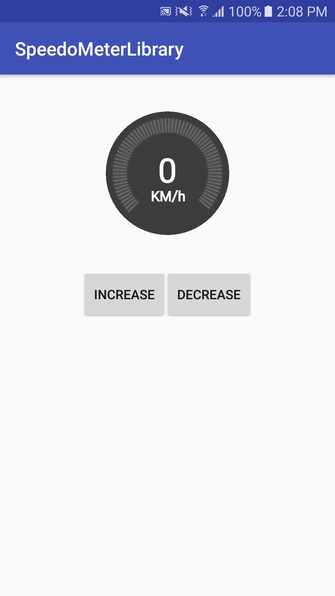
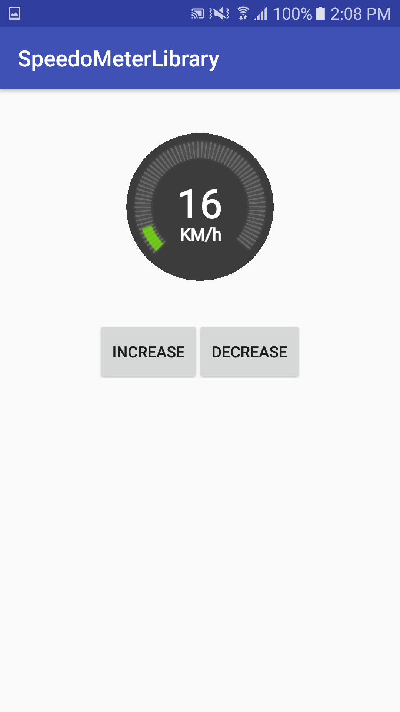
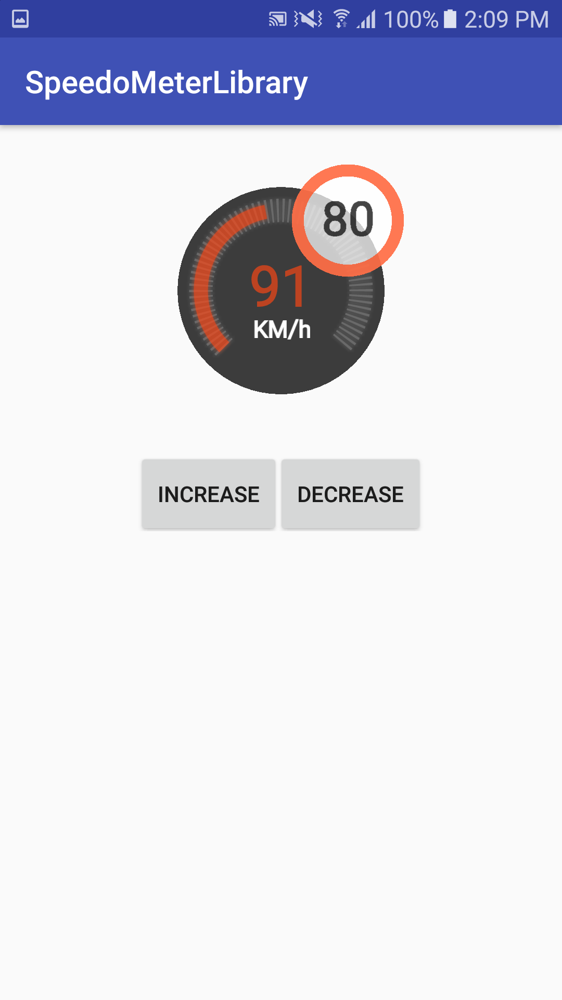
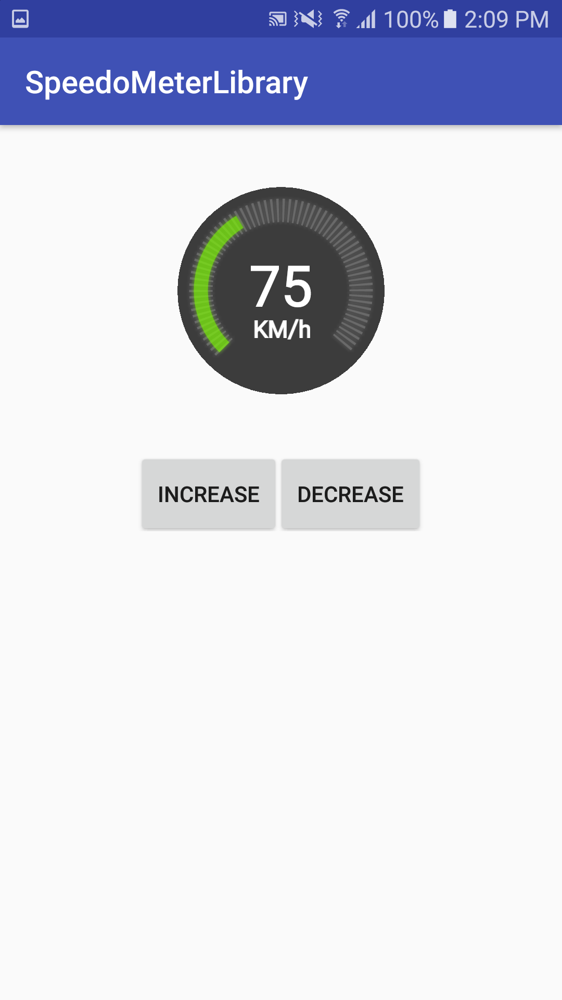

# SpeedoMeter
<p align"center">

&nbsp;

<br/>

&nbsp;


Basic useful feature list:

 * Show Speed With animation
 * Ability to change background, colors, text size and so on.
 * Show speed limit view on speedometer
 * Easy to use
 
#Getting Started

add below line into your build.gradle file.
```java
    dependencies {
        compile 'com.github.mshohrat:SpeedoMeter:1.0.0'
    }
```

# How to use

For using library the only thing that you should do is adding a Speedometer to xml layout or make new in java code and do everything you want with it. :))
```java
    <com.chalik.speedometer.Speedometer
            android:id="@+id/tv_speed"
            android:layout_width="180dp"
            android:layout_height="180dp"
            android:layout_gravity="center"
            app:currentSpeed="20"
            app:maxSpeed="180"
            android:layout_margin="16dp"
            android:visibility="visible"
            speedometer:speedLimit="80" />

```

```java
    Speedometer speedometer = new Speedometer(this);
    speedometer.setCurrentSpeed(20);
    speedometer.setmMaxSpeed(180);
    speedometer.setSpeedLimit(80);

```

```java
    speedometer.speedTo(80);
```
also for more information you can see demo app. 

# Versioning
Text about versioning

## Authors
* Meysam Shohrat

## License
This project is licensed under the GNU General Public License - see the LICENSE.md file for details
